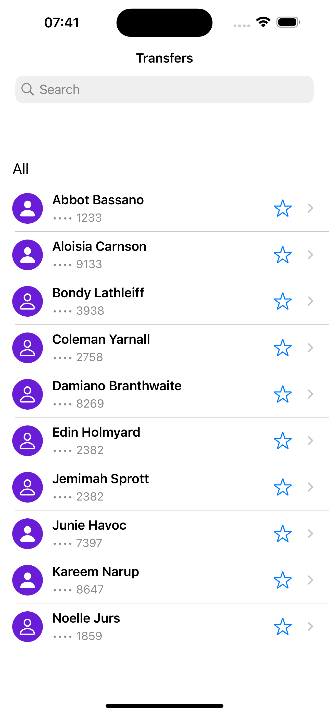
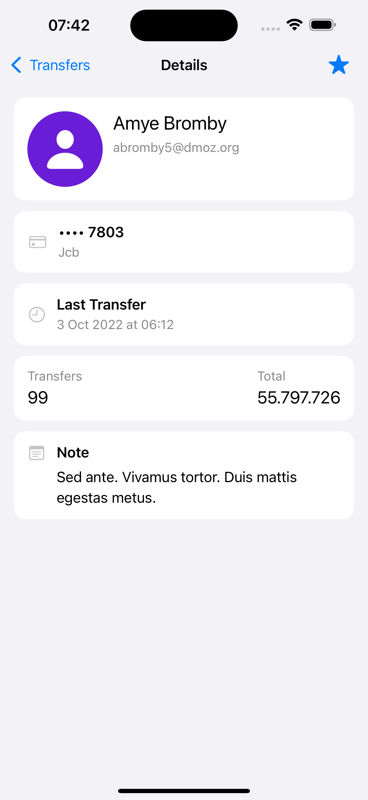
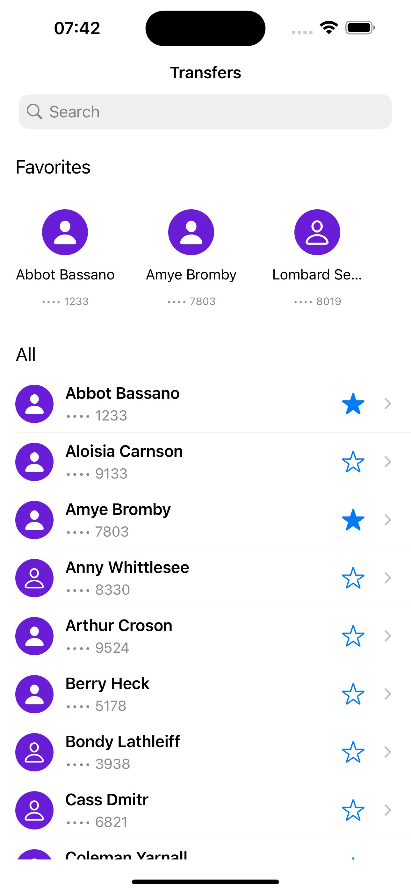
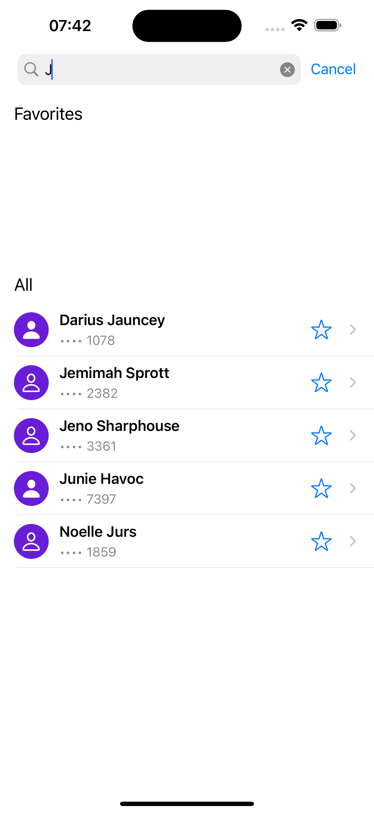

# TransferList iOS App

TransferList is an iOS sample application built with **Swift** and **Combine**, following **Clean Architecture** and the **MVVM** pattern.  
It demonstrates a scalable way to display and manage a list of money transfers with a persistent favorites section.

---

## ✨ Features

- **All Transfers**: Loads a paginated list of transfers from a mock REST API.
- **Favorites**: Lets users mark transfers as favorites.  
  - Favorites are stored persistently in `UserDefaults`.
  - A horizontal favorites list appears on the home screen when items are favorited.
- **Details Screen**: Shows full transfer information and allows toggling favorite state.
- **Search**: Filters both the all-transfers list and the favorites list in real time.
- **Reactive updates**: Favorites state updates across all screens immediately.
- **Offline-friendly**: Already-loaded transfers and favorites are preserved between app launches.

---

## 🛠 Technologies Used

- **Swift 5+**: Core language.
- **Combine**: Reactive bindings for networking, search, and favorites updates.
- **UIKit**: UI built entirely in code (no Storyboards, no SnapKit).
- **UserDefaults**: Lightweight persistent store for favorites.
- **Swift Testing** (`import Testing`): Modern, concise test framework built into Xcode 16+.
- **Git**: Version control.

*(SnapKit was removed to keep the project zero-dependency.)*

---

## 🏛 Architecture

The app follows **Clean Architecture** with **MVVM**:

| Layer            | Responsibility |
|------------------|----------------|
| **Entities**     | Pure Swift models (`Transfer`, `Person`, `Card`, etc.) that are independent of frameworks. |
| **DTOs**         | Network representations (`TransferDTO`) used only for decoding JSON. |
| **Use Cases**    | Business logic (fetching pages, observing loaded transfers, checking or toggling favorites). Each use case has a small protocol (`…UseCaseProtocol`) for easy mocking. |
| **Repositories** | Bridge between network and domain, caching already loaded transfers and exposing reactive publishers. |
| **Presentation** | View models and view controllers for Home, All Transfers list, Favorites list, and Details screen. |
| **Application / DI** | `AppDIContainer` wires everything together and provides dependency injection. |

This separation keeps the codebase modular, testable, and easy to evolve.

---

## ⚡️ App Flow

1. **Home Screen**  
   - Top horizontal favorites section (appears only when there are favorites).  
   - Full vertical list of all transfers.  
   - Built-in search filters both lists.

2. **Details Screen**  
   - Shows full details of a transfer (person, card, notes, totals).  
   - Allows adding/removing the transfer from favorites.

3. **Favorites Persistence**  
   - Favorites are stored locally and restored on launch.

---

## 🖼 Screenshots

| Home Screen | Details Screen | Favorites List | Search Results |
|-------------|---------------|----------------|----------------|
|  |  |  |  |

---

## 🧩 Project Setup

### Requirements
- Xcode 16.0 or later  
- Swift 5.9 or later  
- macOS 15.6 or later

### Installation
```bash
git clone https://github.com/YaserBahrami/TransferList.git
cd TransferList
open TransferList.xcodeproj
```
---
## 🧪 Testing & Code Coverage

The project ships with a **comprehensive unit-test suite** using the modern **Swift Testing** framework.

- **Scope**: Covers use cases, repositories, view models, and formatting helpers.
- **Technologies**: Uses `Combine` publishers and `AsyncSequence` to test reactive flows.
- **Organization**: Test doubles (`MockTransferRepository`, `InMemoryFavoritesStore`) live in `Tests/Support` to keep tests fast and deterministic.

### Running the tests
- In Xcode: **⌘U**  
- Or from the command line:
  ```bash
  xcodebuild test -scheme TransferList -destination 'platform=iOS Simulator,name=iPhone 16'
  ```

## License

This project is licensed under the [MIT](https://choosealicense.com/licenses/mit/) license
